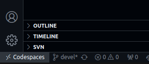
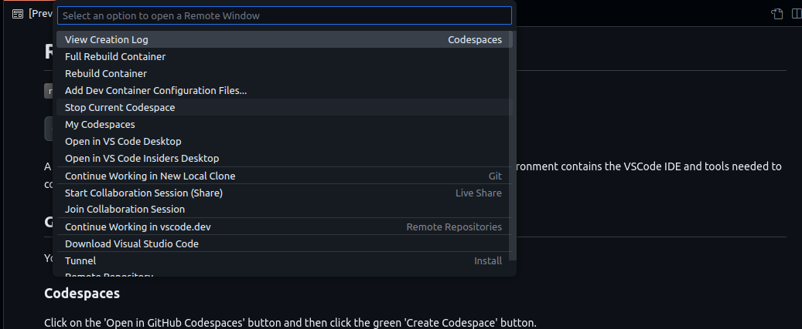
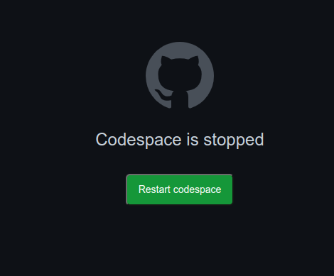
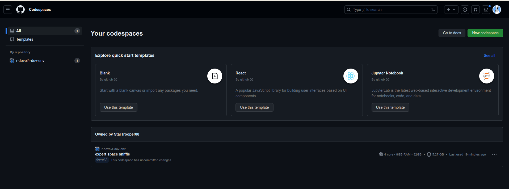

#### How to Stop Codespaces?
- To stop codespaces we just need to navigate to the Codespaces option in the bottom left of the Codespace panel.

  

- After clicking on codespaces option we will get a drop down above something like this👇

  

- Click on "Stop Current Codespace". It will stop the codespaces you are currently using or running.

- You will be redirected to a Restart Codespaces page. The page shows a link to restart the codespace you just stopped.

  

#### Idle timeout:
If you do not interact with the codespace, it will close automatically when it reaches the idle timeout limit. By default, this is 30 minutes, but you can [set a personal timeout](https://docs.github.com/en/codespaces/setting-your-user-preferences/setting-your-timeout-period-for-github-codespaces#setting-your-default-timeout-period) limit in your GitHub settings.

#### How to Restart Codespaces again?

- Go to [github.com/codespaces](https://github.com/codespaces)
- Here we can see a list of the codespaces we have created
  
- To restart it, we can just click on the codespaces we wanted to use and it will start the codespaces again for us.
- You can also see an active label added to the codespaces we just started
 
