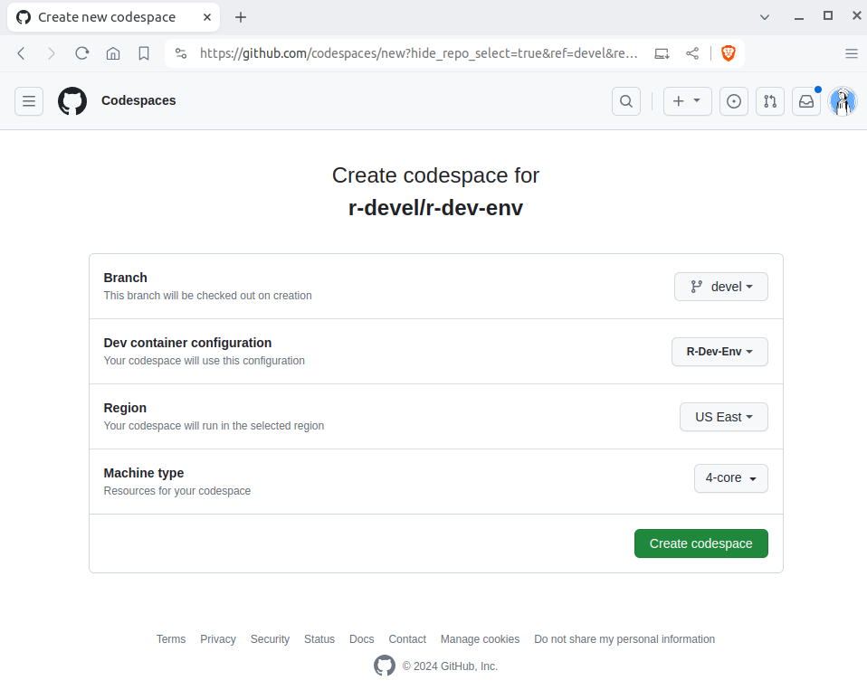
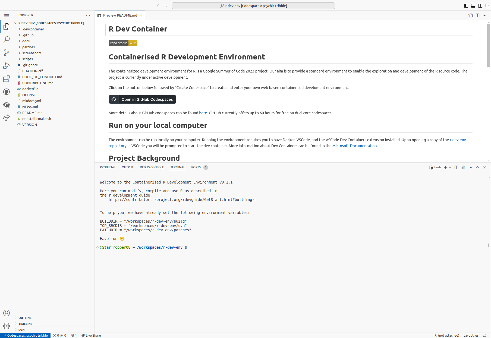

1. From the main branch of the [r-dev-env repo](https://github.com/r-devel/r-dev-env/tree/main), click on the 'Open in GitHub Codespaces' button and then click the green 'Create Codespace' button.

    !!! Note
        You will see the message "Codespace usage for this repository is paid for by ...", with your username. Don't panic!

        GitHub Codespaces offers 120 core hours of free usage per month for every GitHub user. So the actual number of free hours is 120 divided by the number of cores you are using to run your codespaces.
        For the r-dev-env codespace we have set the codespace usage to 4 cores which leads to 30hrs of free usage per month. This can be changed according to your preference.

        For more details about codespaces billing, see the [Codespaces Billing Docs](https://github.com/features/codespaces). 
        You can calculate your GitHub services usage with the [GitHub Services Pricing Calculator](https://github.com/pricing/calculator) and check your usage allowance under "Codespaces" on your [GitHub Billing page](https://github.com/settings/billing).

2. The codespace setup screen will then be shown. Starting the container may take a minute or so.

3. You will be taken to a VSCode editor within your browser.

