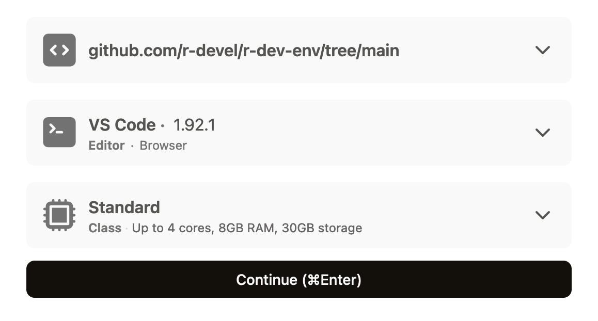

### Starting a Gitpod Workspace

1. **Log In:**
Go to the [Gitpod login page](https://gitpod.io/login/) and sign in with your GitHub, GitLab, or Bitbucket account. This allows Gitpod to create workspaces from your repositories.

2. **Connect Your Git Provider:**
Connect Gitpod to your GitHub, GitLab, or Bitbucket account by authorizing access. This allows Gitpod to create workspaces from your repositories.

3. **Create a workspace using the R Dev Container repo:**
Click on the Gitpod badge below, to open the Gitpod workspace creation dialog with the relevant options pre-filled.

    

       

4. **Create a New Workspace:**
In the Gitpod dashboard, click on the "Continue" button. You can change the resource option from standard to large. After clicking continue, it will take approximately 15-20 minutes to create the workspace for the first time. It will cache the environment for faster startup in the future.

    !!! Note
        Changing the resource option will reduce the free monthly Gitpod usage, which is 50 hours per month.