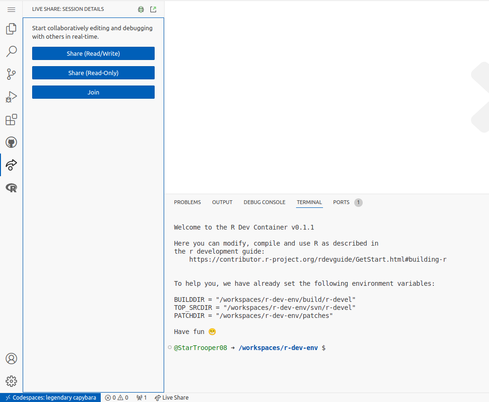
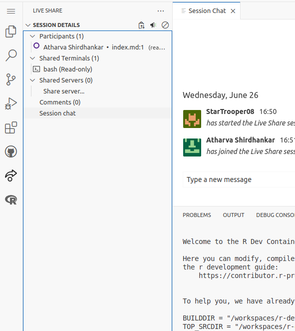
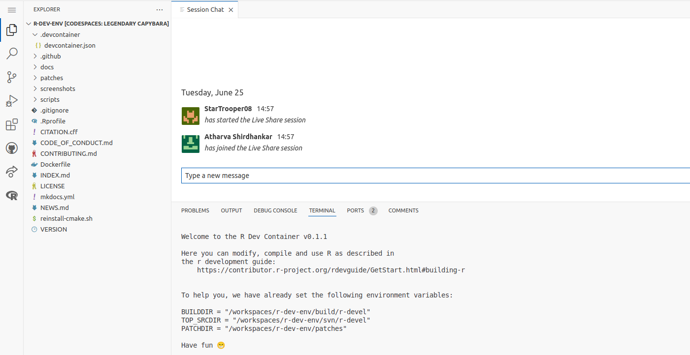

Live Share is a powerful feature that allows you to collaborate with others in real time directly within VS Code/GitHub Codespaces. You can share your code, terminal, debugging sessions, and more with your collaborators. To use Live Share with the R Dev Container follow the guide below.

!!! Note

    If you are using the R Dev Container locally you must have the Live Share Extension installed to start a Live Share Session. You will be asked to sign in using your Microsoft or GitHub account when starting the session.

### Start a Live Share Session

1. **Click the "Live Share" button** in the status bar.
Alternatively you can go to Live Share extension tab and select from the options to share with read/write permission or share with read-only permission.

2. **Share the Link**: A sharing link will be generated and copied to the clipboard for sharing with your collaborators. From the pop-up dialog, you can copy the link again or switch the permissions from read/write to read-only (or vice versa).

### Join a Live Share Session

1. **Receive the link** from the host. The link will be of the form `https://prod.liveshare.vsengsaas.visualstudio.com/join?[37 alphanumberic characters]`
2. **Choose how to join the session:**

    - **Open the link in a web browser**: click the link to open it in your web browser. If you have VS Code installed locally, a pop-up dialog will give you the choice of continuing in the web or opening the session in VS Code. You can join the session anonymously or sign in with your Microsoft or GitHub account.
    - **Copy the link into VSCode or the R Dev Container Codespace**: From the Live share extension tab, click the "Join" button. If you are using VS Code locally, you can choose to join the session anonymously or sign in with your Microsoft or GitHub account. If you are using the Codespace, you will already be signed in with your GitHub account. A pop-up at the top of the VSCode window will ask for the Live Share session link. Paste the link and click 'Enter'.
. 

3. **Wait to be accepted by the host**. The host will receive a pop-up message where they can accept your request to join.

### Collaborate in Real-Time

Once joined, you can:

- **Edit Code Together**: Both the host and guests can edit files, and changes will be synchronized in real-time.
- **Share Terminals**: The host can share bash or R terminals. Guests can see the terminal output and, if granted permission, type commands.
- **Live Chat**: Session chat can be opened from the Live share extension tab.

### Manage control

1. **Manage permissions**: In a session with read/write permissions, the host can change permissions for each shared terminal by right-clicking the terminal name on the Live Share tab.
2. **Follow Mode**: Both the host and guests can enable "Follow Mode" to follow each other’s cursor and view.

### Session persistance

You can rejoin a session if disconnected, and your previous state will be restored.

### Close a Live Share Session

When you want to close the live share session, you can go to Live Share Extension tab and click on stop icon. 
.

If you are a guest, the live share session will continue to run without you. If you are the host this will close the session for everyone.

Alternatively, you can click the "Live Share" button in the status bar to leave or stop the session.

### Tips for Effective Collaboration

- **Use Voice/Video Chat**: Combine Live Share with a voice or video call (e.g., Zoom, Teams, etc.) for better communication.
- **Share Comments**: Use comments in the code to communicate specific points or suggestions.
