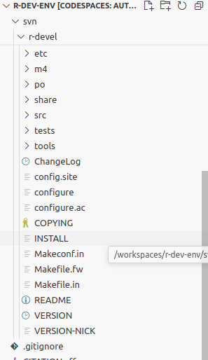
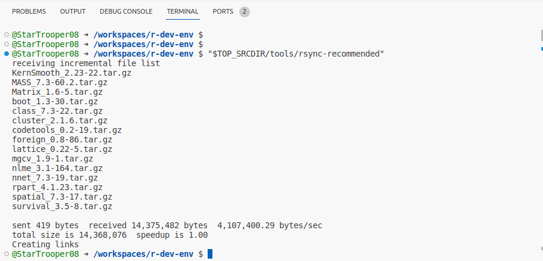

**1) Environment variables**

- We have environment variables defining paths to directories for building R and storing the source code.
- `BUILDDIR` defines the build directory: `/workspaces/r-dev-env/build/r-devel`. 
- `TOP_SRCDIR` defines the source directory: `/workspaces/r-dev-env/svn/r-devel`
- The environment variables are set in the codespace image and are available when the codespace starts.

  
  
**2) svn checkout**

- The svn checkout command lets us create a local copy of a specific tag/branch of a repository.
- We can check out the latest version of the trunk (the main branch) of the R sources to $TOP_SRCDIR as follows:
```bash
   svn checkout https://svn.r-project.org/R/trunk/ $TOP_SRCDIR
```
- Output : We get file structure something like this after checking out R source code from R svn repository.

   

**3) Download recommended packages for R**

To build R with the recommended packages, we need to run the `tools/rsync-recommended` script from the source directory to download the source code for these packages:
```bash
$TOP_SRCDIR/tools/rsync-recommended
```


**4) Change to the build directory**
   
- To keep the source directory clean, we change to a build directory to configure and build R.

- First create the directory specified by the BUILDDIR environment variable.
```bash
mkdir -p $BUILDDIR
```

- Then we can change directory from root to the build directory.
```bash
cd $BUILDDIR
```

**5) Configure the build**

- After we change directory, we must run the configure script from the source directory.
This step takes ~1 minute on the codespace.
```bash
$TOP_SRCDIR/configure

```

- The configure cmd prepares for building R, creating files and folders inside the BUILDDIR directory.
- Output : We get file structure something like this after using configure command.
     
   

**6) Build R**

Having configured R, we run `make` to build R. This take 5-10 minutes on the codespace.
```bash
make
```
**7) Check R**

Check that the build of R passes R's standard checks:
```bash
make check
```
This takes a couple of minutes in the codespace. The check will stop with a error message if any of the tests fail. If this happens, see [SVN Help](./svn_help.md) for how to revert to a version that passes check.

**8) Make R terminals use the built R**

Run the `which_r` script to set which R to use for R terminals in VSCode. When prompted, enter the number corresponding to `r-devel`
```
which_r
```
```
Which version of R should be used in new R terminals?
  1. R 4.4.0 (release version built into this container)
  Additional R builds available:
    2. r-devel
Enter the number corresponding to the selected version: 
```
This means that new R terminals will use the version of R you have just built![^1]

[^1]: To switch back to the release version, run `which_r` and type `1`. The 
selected version is saved in the VSCode settings, so will be saved when you 
stop and restart the codespace.

**9) Make contributions**

- After having built the current development version of R, we can now make changes to the source code and contribute to the project.
- Follow the [R Contribution Workflow](./contribution_workflow.md) tutorial to learn how to do this.