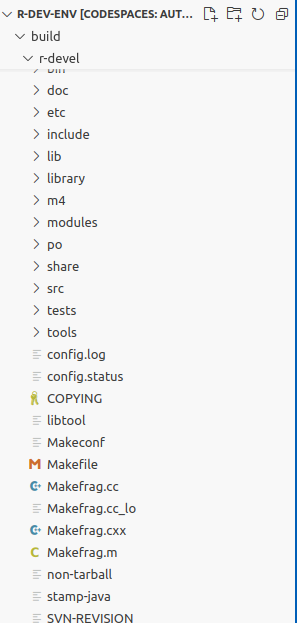
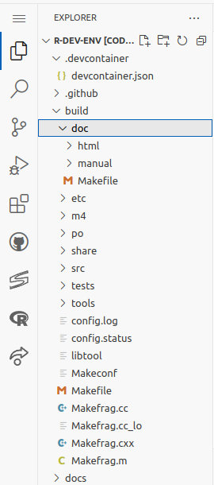

## R Contribution Workflow

### Build Setup (Without Recommended Packages)
**1) Environment Variables**

- We have environment variables for setting the paths for building R and storing the source code.
- The path ENV variable for R Build and R Source code are BUILDDIR and TOP_SRCDIR respectively.
- The environment variables are set in the codespace image and are available when the codespace starts.

  

**2) svn checkout**

- The svn checkout cmd lets us create working of a repository with specific tag/branch.
- Command:
   ```bash
     svn checkout https://svn.r-project.org/R/trunk/ "$TOP_SRCDIR"
   ```
- Output : We get file structure something like this after checking out R source code from R svn repository.

   

**3) Change Directory to BUILDDIR**
   
- We need to change our directory to R build directory(BUILDDIR) to build and configure our R source code.

- First we will create a directory using env var BUILDDIR.
- Command:
```bash
mkdir -p $BUILDDIR
```

- Then we can change directory from root to $BUILDDIR one.
- Command:
```bash
cd $BUILDDIR
```

**4) configure source code**

- After we change directory to BUILDDIR we can configure and build R.
- Commands :
```bash
"$TOP_SRCDIR/configure" --enable-R-shlib --without-recommended-packages
make
sudo make install
```


- The configure cmd prepares for building R, creating files and folders inside the BUILDDIR directory.
- Output : We get file structure something like this after using configure command.
     
   

**5) Make Contributions**

- After having built the current development version of R, we can now make changes to the source code and contribute to the project.

### Build Setup (With Recommended Packages)
This build setup differs from the above because the recommended packages for R are included.

**1) Checkout the R source using svn.**

- Command:
```bash
svn checkout https://svn.r-project.org/R/trunk/ "$TOP_SRCDIR"
```


**2) Create a directory using the environment variable called BUILDDIR.**

- Command:
```bash
mkdir -p $BUILDDIR
```


**3) Then we will install recommended packages using cmd**

- Command:
```bash
"$TOP_SRCDIR/tools/rsync-recommended"
```

   

**4) We can now change directory to $BUILDDIR using cmd**

- Command:
    ```bash
       cd $BUILLDIR
    ```


**5) configure source code**

   - After we change directory to BUILDDIR we can configure and build R.
   - Commands:
        ```bash
          "$TOP_SRCDIR/configure" --enable-R-shlib
          make check
          make
        ```


   - The configure script sets options and settings for building R, creating files and folders inside the BUILDDIR directory.
   - After running the configure script the file structure of the build directory is something like the below.
   