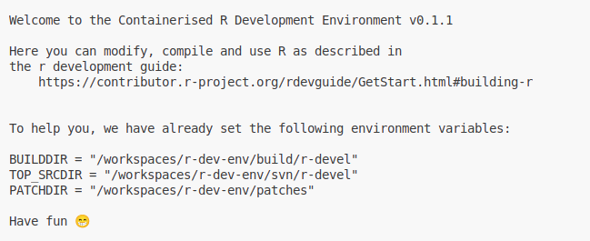

## R Contribution Workflow

### Build Setup (Without Recommended Packages)
**1) Environment Variables**

- We have environment variables defining paths to directories for building R and storing the source code.
- `BUILDDIR` defines the build directory: /workspaces/r-dev-env/build/r-devel
`TOP_SRCDIR` defines the source directory: /workspaces/r-dev-env/svn/r-devel
- The environment variables are set in the codespace image and are available when the codespace starts.

   //newss
**2) svn checkout**

- The svn checkout command lets us create a local copy of a specific tag/branch of a repository.
- We can check out the latest version of the trunk (the main branch) of the R sources to $TOP_SRCDIR as follows:
   ```bash
     svn checkout https://svn.r-project.org/R/trunk/ $TOP_SRCDIR
   ```
- Output : We get file structure something like this after checking out R source code from R svn repository.

   //newss

**3) Change to the build directory**
   
- To keep the source directory clean, we change to a build directory to configure and build R.

- First create the directory specified by the BUILDDIR environment variable.
```bash
mkdir -p $BUILDDIR
```

- Then we can change directory from root to the build directory.
```bash
cd $BUILDDIR
```

**4) configure the build**

- After we change directory, we must run the configure script from the source directory.
This step takes ~1 minute on the codespace.
```bash
"$TOP_SRCDIR/configure"
make
make check
```


- The configure cmd prepares for building R, creating files and folders inside the BUILDDIR directory.
- Output : We get file structure something like this after using configure command.
     
    //newss

**5) Make Contributions**

- After having built the current development version of R, we can now make changes to the source code and contribute to the project.
- Follow the [R Contribution Workflow](./contribution_workflow.md)tutorial to learn how to do this.

### Build Setup (With Recommended Packages)
This build setup differs from the above because the recommended packages for R are included.

**1) Checkout the R source using svn.**

```bash
svn checkout https://svn.r-project.org/R/trunk/ "$TOP_SRCDIR"
```


**2) Create a directory using the environment variable called BUILDDIR.**

```bash
mkdir -p $BUILDDIR
```


**3) Download the source code for the recommended packages**

To build R with the recommended packages, we need to run the tools/rsync-recommended script from the source directory to download the source code for these packages:


```bash
"$TOP_SRCDIR/tools/rsync-recommended"
```

   

**4) We can now change directory to $BUILDDIR using cmd**

- Command:
    ```bash
       cd $BUILLDIR
    ```


**5) configure source code**

   - After we change directory to BUILDDIR we can configure and build R.
   - Commands:
        ```bash
          "$TOP_SRCDIR/configure" --enable-R-shlib
          make check
          make
        ```


   - The configure script sets options and settings for building R, creating files and folders inside the BUILDDIR directory.
   - After running the configure script the file structure of the build directory is something like the below.
   