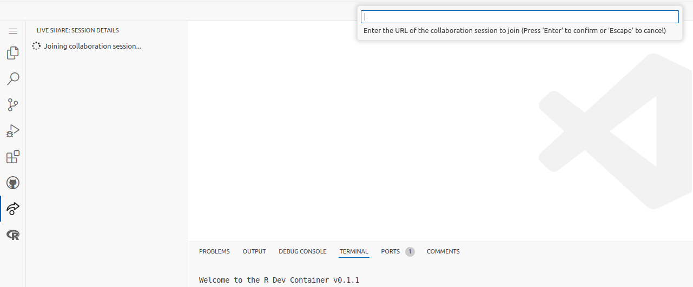
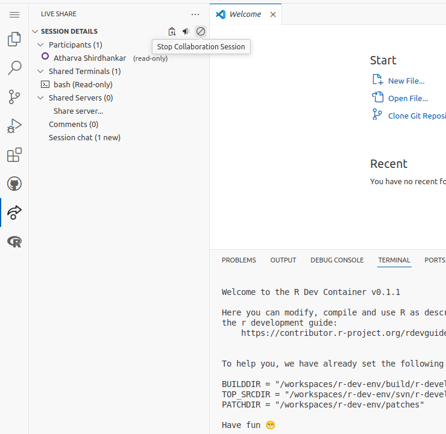

Github Codespaces (VS Code) Live Share is a powerful feature that allows you to collaborate with others in real-time directly within the editor. You can share your code, terminal, debugging sessions, and more with your collaborators. Here’s a step-by-step guide on how to use Live Share with VS Code:

### Step 1: Install Live Share Extension
It's already install on R-dev-env codespaces.
But if you want to install it on Local VSCode Editor and collaborate with developer working on R-Dev-Env Workspace you can install using below steps.

1. **Open VS Code**.
2. **Go to the Extensions View** by clicking the Extensions icon in the Activity Bar on the side of the window or pressing `Ctrl+Shift+X`.
3. **Search for "Live Share"** in the Extensions marketplace.
4. **Install the Live Share Extension** (Visual Studio Live Share by Microsoft).

### Step 2: Sign In to Live Share

1. **After installing the extension**, you’ll see a "Live Share" button on the status bar at the bottom of the VS Code window.
2. **Click the "Live Share" button**. 
3. **Sign in** using your Microsoft or GitHub account.

### Step 3: Start a Live Share Session

1. **Open a Project** or folder that you want to share.
2. **Click the "Live Share" button** in the status bar or press `Ctrl+Shift+P` and then type and select `Live Share: Start Collaboration Session`. 
Alternatively you can go to Live Share extension tab and select the option to start Live share with read/write permission or just read only permission.

3. **Copy the Link**: A sharing link will be generated. You can copy this link and share it with your collaborators.

### Step 4: Join a Live Share Session

1. **Receive the Link** from the host. The link will be something in this form `https://prod.liveshare.vsengsaas.visualstudio.com/join?[37 alphanumberic characters]`
2. **Click on the Link**: It will open VS Code and join the Live Share session automatically.
3. Alternatively, you can **press `Ctrl+Shift+P`**, type `Live Share: Join Collaboration Session`, and then paste the link. Or you can again use the Live share extension tab and join the session using Join option. This will give a pop-up on the top of the VSCode window asking for Live Share session link. Enter link and click 'Enter'.
. 

### Step 5: Close Live Share Session
When you want to close live share session, you can go to Live Share Extension tab and click on stop icon. This will close the live share session.
.

### Step 6: Collaborate in Real-Time

Once joined, you can:

- **Edit Code Together**: Both the host and guests can edit files, and changes will be synchronized in real-time.
- **Share Terminals**: The host can share a terminal with guests. Guests can see the terminal output and, if granted permission, type commands.
- **Debug Together**: Start debugging sessions that all participants can see and interact with.
- **Share Servers**: If you’re running a local web server, you can share it with guests so they can access it in their browsers.

Live Chat using Live Share
.

### Step 7: Manage Permissions

The host has control over the session and can manage permissions:

1. **Sharing Terminals**: When you share a terminal, you can choose to make it read-only or give guests write access.
2. **Read-Only Access**: You can start a session in read-only mode where guests can only view the files but not edit them.
3. **Follow Mode**: Both the host and guests can enable "Follow Mode" to follow each other’s cursor and view.

### Step 8: End the Live Share Session

1. **Click the "Live Share" button** again in the status bar.
2. Select **"End Collaboration Session"** to stop sharing your environment.

### Tips for Effective Collaboration

- **Use Voice/Video Chat**: Combine Live Share with a voice or video call (e.g., Zoom, Teams, etc.) for better communication.
- **Share Comments**: Use comments in the code to communicate specific points or suggestions.
- **Debug Together**: Utilize the shared debugging capabilities to troubleshoot issues collaboratively.

### Additional Features

- **Session Persistence**: You can rejoin a session if disconnected, and your previous state will be restored.
- **Guest Invitations**: You can invite specific people to join your session from the Live Share extension.
